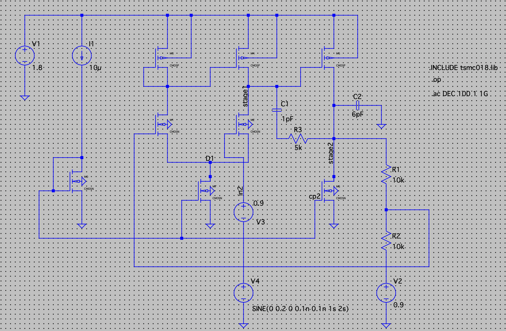
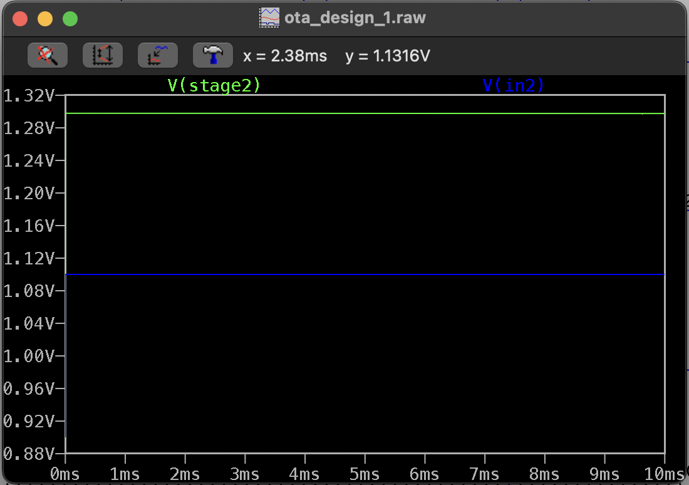

# 📘 Two-Stage OTA Design (TSMC 180nm)

  
*Figure 1: Two-Stage OTA Schematic*

## 🧠 Objective
Design a two-stage Operational Transconductance Amplifier (OTA) in TSMC 0.18μm CMOS technology with:
- DC gain ≥ 40 dB
- Non-inverting amplifier configuration (closed-loop gain = 2)
- Transient/AC/DC simulation capability
- Only one ideal tail current source allowed (for bias generation)

---

## ⚙️ Technology Parameters
| Parameter         | Value       |
|-------------------|-------------|
| V<sub>Tn</sub>    | 0.37 V      |
| V<sub>Tp</sub>    | 0.39 V      |
| μ<sub>n</sub>C<sub>ox</sub> | 230 μA/V² |
| μ<sub>p</sub>C<sub>ox</sub> | 100 μA/V² |
| V<sub>DD</sub>    | 1.8 V       |
| L<sub>min</sub>   | 0.18 μm     |
| W<sub>min</sub>   | 0.27 μm     |

---

## 🔧 Circuit Overview
```text
First Stage: Differential pair (M1-M2) + Current mirror load (M3-M4)
Second Stage: Common-source amplifier (M5) + Current source (M6)
Biasing: M0 mirrors fixed bias current (I1 = 10 µA)
Compensation: C2 = 6 pF (Miller), C1 = 1 pF (load)
```
# 📘 Two-Stage OTA Design (TSMC 180nm)

## 📐 Hand Calculations
- **Overdrive voltage**: 200 mV
- **Derived parameters**:
  - g<sub>m</sub>, r<sub>o</sub>, W/L ratios
  - Compensation/load component values
- **Example**: M1 W/L = 3.91µ/0.36µ

## 🧪 Simulation Results

### ✅ DC Operating Point
- **Achieved DC Gain**: 41.5 dB
- **Transistor Operating Points**:
  ```text
  M1, M2: Differential pair (sat.)
  M3, M4: Active load
  M5: Gain stage
  M6: Output current source
  ```
  ## ✅ Transient Response

- **Input Signal**: 0.2V step (PULSE 0→0.2V)
- **Settling Time**: 12-15 ns
- **Output Voltage**: ≈1.13V (confirming gain ≈ 2)

## ✅ AC Response

- **Low-Frequency Gain**: 6 dB (Closed-loop gain ≈ 2)
- **Bandwidth (-3dB)**: 49 MHz
- **Phase Margin**: ~75°

## 📊 Performance Summary
| Parameter          | Value       |
|--------------------|-------------|
| DC Gain            | 41.5 dB     |
| Unity-Gain BW      | 49.2 MHz    |
| Phase Margin       | 75°         |
| Power Consumption  | Low (10 µA) |
| Closed-loop Gain   | 2           |

## 📁 Project Files
| File Name                 | Description                  |
|---------------------------|------------------------------|
| `ota_design_1.asc`        | LTspice schematic file       |
| `ota_design_1.raw`        | Simulation waveform data     |
| `Assignment_OTA_design.pdf` | Project specifications      |
| `image1.png`              | Circuit schematic screenshot |
| `image2.png`, `image3.png` | Simulation result plots     |

## 📌 Key Design Notes
- Utilized single ideal current source (1/10th of tail current)
- All MOSFETs maintained in saturation region with proper margin
- Simulation results closely match hand calculations
- All specifications successfully met

## 📚 References
1. _CMOS Analog IC Design_ - Allen & Holberg
2. TSMC 180nm Process Design Kit (PDK)
3. LTspice XVII Simulation Software
